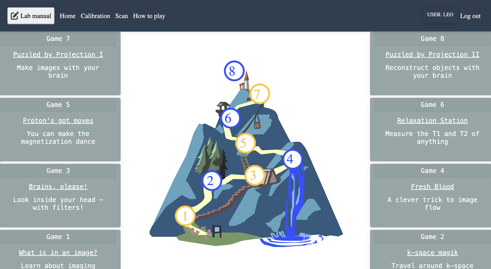

# An MRI virtual Scanner games

{ style="border-radius: 14px;" }

A note on learning MRI the slow way, through games.

There is a room that fits on a desk. Inside it, no one is scanned, and yet everyone is changed. The magnet is imaginary until it is not; the pulse sequence is a recipe you cannot taste; the image arrives like weather, later than expected, exactly when you were ready to stop waiting.

Welcome to the virtual scanner games: not escapism, but escape velocity from the idea that physics must feel like punishment.

---

## The First Koan: What Is an Image?

A beginner asks, what is in an image.  
An advanced student answers with a grid of numbers and a headache named k-space.  
The teacher says nothing and adjusts the window until the world appears.

In the tabletop, this is not a riddle about photography. It is a riddle about limits: field of view, resolution, and the gentle lie of contrast when you brighten what you wish were true. You learn that seeing is editing, and every picture is a negotiation between what happened and what you can afford to show.

---

## The Proton Learns to Dance

Somewhere between a lecture and a dream, a proton is told to move. It does not walk; it precesses, which is walking in circles while insisting you are still going forward. RF pulses arrive like bells. The signal is not a shout; it is the memory of alignment, briefly disturbed and faithfully recorded.

One game calls this *Proton's Got Moves*, as if spin were swagger. It is. The universe's smallest dancer explains the largest machine: if you can love a tiny magnet's obedience, you can forgive a long equation.

---

## Brains, Please

Contrast is not moral judgment; it is timing. T1, T2, and proton density are three ways to be different while being made of the same stubborn water and fat. You choose TR, TE, and flip angle the way a musician chooses tempo: not to dominate the piece, but to reveal the voice you could not hear at first.

If you have ever looked at two "identical" photographs and felt one was truer, you already understand more MRI than you think.

---

## Blood That Refuses to Sit Still

Flow is a beginner's poem and an advanced warning. Motion is not failure; motion is information with a sense of humor. The scanner asks, where did you go? Blood answers by being slightly ahead of the question.

---

## K-Space: The Attic of the Image

*K-space magiK* sounds like a pun because it is, and because Fourier transforms deserve at least one joke. The image you recognize lives in the bright center; edges live in the quiet outskirts where patience is stored. You learn that sharpness is not a virtue everywhere. Sometimes kindness is a little blur.

---

## Relaxation Is Work

T1 and T2 are not rivals; they are two kinds of letting go. In *Relaxation Station*, signal decays the way attention does: first quickly, then slowly, then into a story about what you thought you saw. The FID is honest: it ends. That is why we listen early.

---

## Projection Without a Screen

Two puzzles, forward and inverse: *Puzzled by Projection I* and *II*. Here the tabletop becomes a zen garden. You rake the sand into one view, then ask the sand to explain how it held the whole yard. Projection is humility: taking a world, agreeing to see only a shadow, then inferring the tiger from the stripe.

---

## Why Games, Why Now

MRI is a cathedral built from constraints: safety, gradients, coils, time, and a patient's willingness to remain still while the mind runs everywhere. Virtual scanner games do not remove these constraints; they translate them into something you can poke without consequence.

Built atop Virtual Scanner and simulation workflows, the tabletop is part of a wider hope: DELTA DIY and similar courses can lower the drawbridge between "I could never" and "I just did." High school, college, graduate school, curious specialist, the magnet does not check your transcript. It checks whether you showed up with questions.

---

## The Closing Bell

You will not become enlightened by winning. You become useful by losing gracefully: by watching the phantom disobey your pulse, by seeing the ghost in reconstruction, by laughing when the "obvious" image was only obvious after the tenth try.

The virtual scanner does not take a picture of your body. It takes a picture of possibility: what aligns, what returns, what relaxes, what flows away and still leaves a trace.

Sit at the tabletop.  
Adjust nothing until you must.  
When the image comes, bow to it. It is only light arranged by math, and math arranged by care.

---

Written in the spirit of Virtual Scanner Tabletop: eight paired games, four gentle ladders from beginner to advanced, one invisible room where the mind learns to see.
