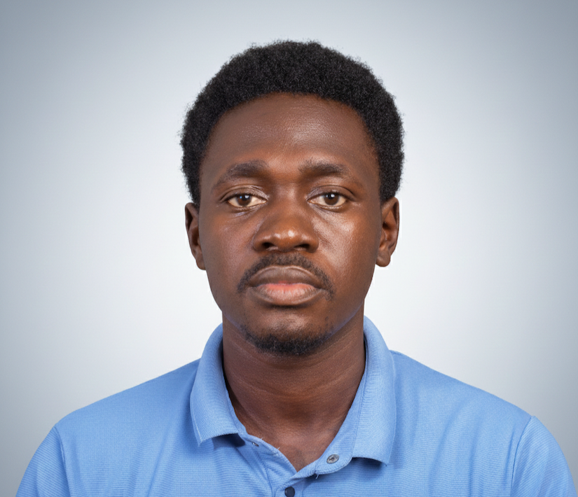

# Leo Kinyera
### Biomedical Engineer | AI Systems Builder | MRI & Embedded Systems Researcher

  

---

I design and build systems that operate beneath the surface—where signals, fields, and intelligence converge.

My work sits at the intersection of:

- **Medical imaging systems** (MRI, RF, gradient design)
- **Artificial intelligence** for signal reconstruction and interpretation
- **Embedded systems and edge intelligence** (TinyML, microcontrollers)
- **Electronics and PCB design** for high-performance applications

I am particularly interested in developing **low-field MRI systems enhanced by AI**, with the goal of making advanced medical imaging more accessible and scalable.

---

## Philosophy

Engineering, to me, is not about assembling components. It is about understanding the **invisible forces** that govern how systems behave—and designing with those forces in mind.

I approach problems from first principles, focusing on:
- Signal behavior rather than abstraction
- System interactions rather than isolated parts
- Constraints as drivers of innovation

---

## Selected Work & Research

- AI models for enhancing low-field MRI image quality
- Gradient system design and slice-select implementation
- RF coil design and signal acquisition systems
- Embedded AI systems on constrained hardware
- Safety frameworks for MRI (PNS and SAR monitoring)

---

## Connect

- **GitHub**: [LeoMcBills](https://github.com/LeoMcBills)
- **LinkedIn**: [Leo Kinyera](https://www.linkedin.com/in/leo-kinyera-8276b9241)
- **X (Twitter)**: [@LeoKinyera](https://x.com/LeoKinyera)

---

## Resume & CV

[Download my full resume here](path/to/resume.pdf)  <!-- Update with actual path -->

---

[Read my latest blog posts](/blog/)

You can download my professional documents below:

- [Download Resume](assets/Leo_Kinyera_Resume.pdf)  
- [Download CV](assets/Leo_Kinyera_CV.pdf)  

> *(If links do not work, ensure the files are placed inside the `docs/assets/` directory in your MkDocs project.)*

---

## Closing Note

I am currently focused on building systems that integrate **physics, intelligence, and hardware** into cohesive, real-world solutions.

If your work intersects with these domains—or aims to push the boundaries of medical and intelligent systems—  
I am always open to meaningful collaboration.